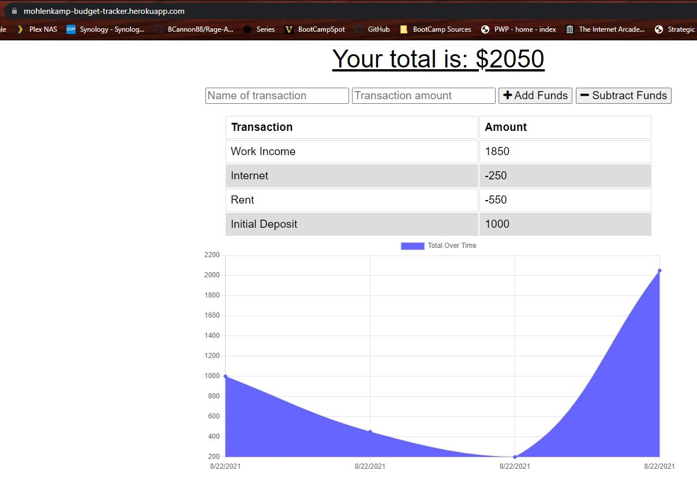

# BudgetTracker

Budget Tracking Progressive Web Application

## John Mohlenkamp
## Aug 22, 2021

## GitHub Location: https://github.com/Mohlenkamp/BudgetTracker

## Heroku Location: https://mohlenkamp-budget-tracker.herokuapp.com/

## Description 

This is a progressive web application that uses mongo/node/mongoose/indexdb to create a simple budget tracking program. It will allow users to track deposits and expenses over time and synchronize any offline transactions through IndexDB once the connection is re-established.

Screenshot example of application:
